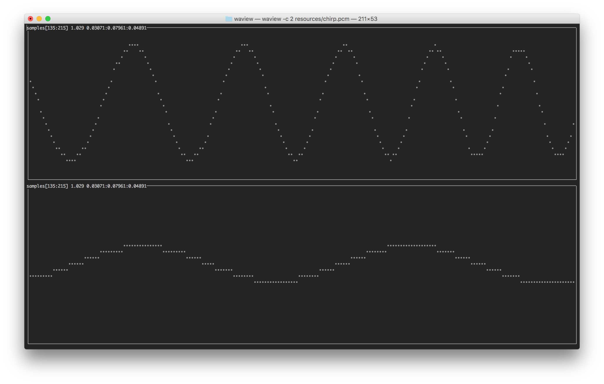

# Waview

View audio files in the terminal.




## Usage
Display the help message
```
$ waview --help

usage: waview [-h] [-f {S16_LE}] [-c CHANNELS] [-z ZOOM] [-l LOGFILE] [-v]
              inputfile

positional arguments:
  inputfile             File to display. The format will be determined
                        automatically.

optional arguments:
  -h, --help            show this help message and exit
  -f {S16_LE}, --format {S16_LE}
                        Sample format for raw files
  -c CHANNELS, --channels CHANNELS
                        Number of channels for raw files
  -z ZOOM, --zoom ZOOM  Initial zoom value
  -l LOGFILE, --logfile LOGFILE
                        Log file path
  -v                    Log verbosity
```

### Controls
* left/right - shift left or right
* up/down - zoom in or out
* r - reset view
* q - quit


## Install

### Install with pip
```
git clone https://github.com/richardmitic/waview.git
cd waview
pip install .
```

### Dependencies
* numpy
* scipy
